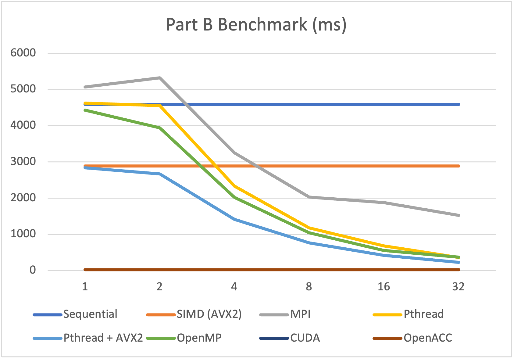

# Project 1 Student Report

Student ID: 116020237

## Compile Commands

```sh
cd project1
cmake -B build
cmake --build build --parallel 4 --verbose
```

## Part A

### Run Command

```sh
sbatch ./src/scripts/sbatch_PartA.sh
```

### Output

The experimentation result based on `sbatch` benchmark is the following:

| Number of Processes / Cores | Sequential | SIMD (AVX2) | MPI | Pthread | OpenMP | CUDA | OpenACC |
|-----------------------------|------------|-------------|-----|---------|--------|------|---------|
| 1                           | 641        | 427         | 643 | 719     | 598    | 27   | 28      |
| 2                           | N/A        | N/A         | 788 | 643     | 594    | N/A  | N/A     |
| 4                           | N/A        | N/A         | 504 | 343     | 447    | N/A  | N/A     |
| 8                           | N/A        | N/A         | 363 | 204     | 297    | N/A  | N/A     |
| 16                          | N/A        | N/A         | 278 | 100     | 184    | N/A  | N/A     |
| 32                          | N/A        | N/A         | 287 | 72      | 137    | N/A  | N/A     |

The graph:

<div>
    
</div>

## PartB

### Run Commands

#### Run Tests

This will run all cpu & gpu programs of PartB and check whether
`Lena-test.jpg` is identical to `Lena-Smooth.jpg`.

```sh
python3 ./src/scripts/tests.py
```

#### Run Benchmark

```sh
sbatch ./src/scripts/sbatch_PartA.sh
```

### Output

| Number of Processes / Cores | Sequential | SIMD (AVX2) | MPI  | Pthread | Pthread + AVX2 | OpenMP | CUDA | OpenACC |
|-----------------------------|------------|-------------|------|---------|----------------|--------|------|---------|
| 1                           | 4593       | 2887        | 5072 | 4619    | 2837           | 4425   | 23   | 24      |
| 2                           | N/A        | N/A         | 5325 | 4556    | 2669           | 3941   | N/A  | N/A     |
| 4                           | N/A        | N/A         | 3248 | 2331    | 1413           | 2017   | N/A  | N/A     |
| 8                           | N/A        | N/A         | 2030 | 1177    | 763            | 1040   | N/A  | N/A     |
| 16                          | N/A        | N/A         | 1876 | 682     | 424            | 559    | N/A  | N/A     |
| 32                          | N/A        | N/A         | 1527 | 364     | 226            | 374    | N/A  | N/A     |

The graph:

<div>
    
</div>

## Comments

### Optimizations

1. Unrolling tight and small loop in PartB-sequential increases a whooping
   100% speedup. Memory access should be very careful for high performance code!

2. Hard code filter indices brings good performance since the filter is a const array.

3. Eliminate index computation in tight loops by multiplication
   (e.g., `height * width + xx`), but use incremental index
   (e.g., `pos += width`) or something similar.

4. Combining SIMD and threading gives good CPU performance.

5. In SIMD part, `set` methods such as `_mm256_set_epi8` is very inefficient,
   and it is **not a single instruction**! Never use this for high performance code.
   Use `load` to properly load value into SIMD registers.

6. 256-bit wide SIMD instructions can be more energy efficient than 512-bit,
   and can have better compatibility to wider cpu-platforms.

7. In CUDA code, using `double` filter makes the computation about
   10x slower than `single` filter.

### Other Observations

- It is interesting that there is usually little improvement from 1 core
  to 2 cores. Is the overhead of multithreading that big? Why is this?
