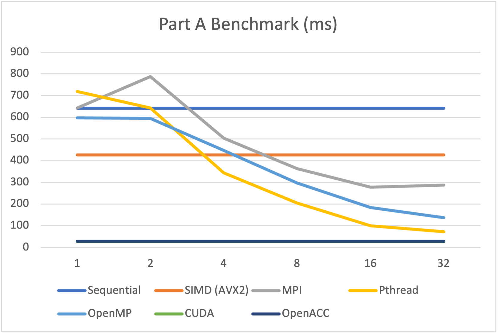

# Project 1 Student Report

Student ID: 116020237

## Compile Commands

```sh
cd project1
cmake -B build -DCMAKE_BUILD_TYPE=Release
cmake --build build --parallel 4 --config Release --verbose
```

## Part A

### Run Command

```sh
sbatch ./src/scripts/sbatch_PartA.sh
```

### Output

The experimentation result based on `sbatch` benchmark is the following:

| Number of Processes / Cores | Sequential | SIMD (AVX2) | MPI | Pthread | OpenMP | CUDA | OpenACC |
|-----------------------------|------------|-------------|-----|---------|--------|------|---------|
| 1                           | 641        | 427         | 643 | 719     | 598    | 27   | 28      |
| 2                           | N/A        | N/A         | 788 | 643     | 594    | N/A  | N/A     |
| 4                           | N/A        | N/A         | 504 | 343     | 447    | N/A  | N/A     |
| 8                           | N/A        | N/A         | 363 | 204     | 297    | N/A  | N/A     |
| 16                          | N/A        | N/A         | 278 | 100     | 184    | N/A  | N/A     |
| 32                          | N/A        | N/A         | 287 | 72      | 137    | N/A  | N/A     |

The plot is here:

<div>
    
</div>
